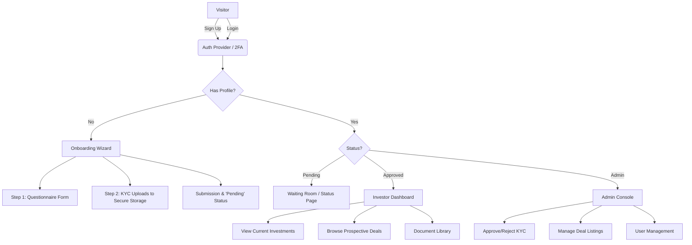

USE BUN AS A RUNTIME TO DOWNLOAD IT....

Based on the detailed requirements in your **Investor_Portal.docx** and your choice of **Next.js**, I have designed a complete technical flow and development roadmap.

Since this is a financial platform handling sensitive KYC data and capital commitments, the architecture prioritizes **security (Role-Based Access Control)** and **data integrity**.

### High-Level Architecture Diagram

This flow visualizes the logic described in Section 7 of your document (Onboarding vs. Existing User).



---

### 1\. The Tech Stack Strategy

To achieve the objectives in the document (Secure, Fast, Scalable), here is the recommended stack:

- **Framework:** Next.js 14/15 (App Router) - For server-side rendering and security.
- **Language:** TypeScript - Mandatory for financial apps to prevent data errors.
- **Database:** PostgreSQL - Relational DB is best for connecting Investors $\leftrightarrow$ Deals.
- **ORM:** Prisma - To manage your database schema easily.
- **Authentication:** Auth.js (NextAuth) or Clerk. _Recommendation: Clerk_ handles 2FA and user management out of the box, saving you weeks of security work.
- **File Storage:** AWS S3 (Private Buckets) with Presigned URLs. _Never expose KYC documents via public links._
- **Styling:** Tailwind CSS + Shadcn/UI (for clean, professional components).

---

### 2\. Database Schema Design (The Foundation)

Based on **Section 6** of your document, here is how you should structure your database (Prisma Schema example):

```prisma
// Users and Roles
model User {
  id        String   @id @default(cuid())
  email     String   @unique
  role      Role     @default(INVESTOR) // INVESTOR or ADMIN
  status    Status   @default(ONBOARDING) // ONBOARDING, PENDING, APPROVED, REJECTED
  profile   Profile?
  kycDocs   KycDocument[]
  investments Investment[]
}

// Investor Profile & Questionnaire
model Profile {
  id              String @id @default(cuid())
  userId          String @unique
  user            User   @relation(fields: [userId], references: [id])
  entityType      String // Individual vs Entity
  accreditation   Json   // Questionnaire responses stored here
  phone           String
  residency       String
}

// Security: KYC Documents
model KycDocument {
  id        String   @id @default(cuid())
  userId    String
  user      User     @relation(fields: [userId], references: [id])
  fileKey   String   // S3 Key (not the public URL)
  docType   String   // Passport, Tax ID, etc.
  status    DocStatus @default(PENDING)
}

// Deal Flow
model Deal {
  id          String   @id @default(cuid())
  name        String
  targetRaise Decimal
  minInvest   Decimal
  status      DealStatus // OPEN, CLOSED, FUNDED
  docs        DealDocument[] // PPM, Teaser
  investors   Investment[]
}

// The Link between User and Deal
model Investment {
  id          String   @id @default(cuid())
  userId      String
  dealId      String
  amount      Decimal
  status      InvestStatus // COMMITTED, FUNDED, EXITED
  user        User @relation(fields: [userId], references: [id])
  deal        Deal @relation(fields: [dealId], references: [id])
}
```

---

### 3\. The Development Flow (Step-by-Step)

#### Phase 1: Project Setup & Authentication

1.  **Initialize Next.js:** Set up the project with TypeScript and Tailwind.
2.  **Auth Implementation:**
    - Install Clerk or NextAuth.
    - Configure **Middleware (`middleware.ts`)**. This is crucial. You must protect routes so that only users with `role: "ADMIN"` can access `/admin/*` and unapproved users cannot access `/dashboard`.

#### Phase 2: The Onboarding Flow (The "Wizard")

_Refers to Doc Section 4.2 & 4.3_

1.  **Questionnaire Page:** Build a multi-step form (using `react-hook-form`). When they hit "Next", save the draft to the `Profile` table.
2.  **KYC Upload Component:**
    - Create a drag-and-drop zone.
    - **Security Action:** When a file is dropped, the server generates a temporary "Presigned URL" from AWS S3. The browser uploads the file directly to S3 (bypassing your server to save load).
    - Save the file key (ID) to the database.
3.  **Submission:** When finished, change User Status to `PENDING_REVIEW` and redirect them to a "Thank You/Status" page.

#### Phase 3: The Admin Console

_Refers to Doc Section 4.8_

1.  **KYC Review Table:** Create a table fetching all users with status `PENDING_REVIEW`.
2.  **Document Viewer:** When the Admin clicks "View Passport", the server asks S3 for a temporary (15-minute) view link. This ensures that even if the link leaks, it expires quickly.
3.  **Approve/Reject Logic:** Clicking "Approve" updates the User Status to `APPROVED`, which effectively unlocks the `/dashboard` routes for that investor.

#### Phase 4: The Investor Dashboard

_Refers to Doc Section 4.4 & 4.5_

1.  **Portfolio Summary:** Query the `Investment` table to sum up `amount` where `userId` matches the logged-in user. Display this in a chart.
2.  **Deal Marketplace:**
    - Create a grid of cards fetching from the `Deal` table.
    - Implement filtering (e.g., "Open for Investment" vs "Past Deals").
3.  **Deal Detail Page:** (`/deals/[id]`): Show specific metrics and a "Commit Capital" or "Request Info" button.

---

### 4\. Folder Structure Recommendation

Organize your Next.js `app` directory to separate logic clearly:

```text
/app
 ├── (marketing)      // Public website (About, Home)
 │    └── page.tsx
 ├── (auth)           // Login/Register pages
 │    ├── login/page.tsx
 │    └── register/page.tsx
 ├── (portal)         // LOCKED: Requires Auth
 │    ├── onboarding/ // The Questionnaire & KYC
 │    └── dashboard/  // The Main Investor View
 │         ├── page.tsx          (Overview)
 │         ├── portfolio/page.tsx
 │         ├── deals/page.tsx
 │         └── documents/page.tsx
 ├── (admin)          // LOCKED: Requires Admin Role
 │    └── admin/
 │         ├── investors/page.tsx (KYC Approval)
 │         └── deals/page.tsx     (Create new deals)
 └── api/             // Backend endpoints (webhooks, secure file access)
```

### 5\. Critical "Gotchas" for PE Platforms

1.  **Server Actions vs. API Routes:** Use Next.js **Server Actions** for form submissions (like the questionnaire). It handles security tokens automatically and is cleaner than writing separate API endpoints.
2.  **Decimal Precision:** Never use standard Javascript `number` for currency (e.g., investment amounts). Use a library like `decimal.js` or handle it strictly in the backend to avoid floating-point errors (e.g., $100.00 becoming $99.999999).
3.  **Audit Logs:** As mentioned in your doc (Section 4.1), every time an Admin views a document or approves a user, create a record in an `AuditLog` table. This is essential for compliance.

**Would you like me to generate the code for a specific part, such as the _Database Schema (Prisma)_ or the _Onboarding Wizard_ first?**
